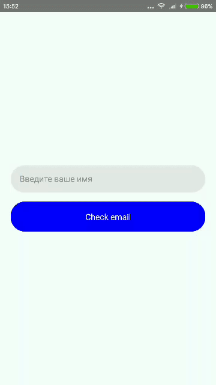

# itkitchen-react-native-ui-lib

itkitchen-react-native-ui-lib is a framework that contains a set of UI components and functions. 

## Setup
To install open your project in command line and run:
```
npm install itkitchen-react-native-ui-lib
```
OR
```
yarn add itkitchen-react-native-ui-lib
```
Thats it!

## Usage

For use you can import Functions and UI:

```javascript
import { Functions, UI } from 'itkitchen-react-native-ui-lib'
```

### Functions
- **_normalize_** - is a function which normalizes the font size of the text relative to the screen size.

```javascript
import { Functions, UI } from 'itkitchen-react-native-ui-lib'

//...

render() {
        return (
            <View style={styles.container}>
                <Text style={{ fontSize: Functions.normalize(14), color: "#000000", marginBottom: 15 }}>Some text</Text>
            </View>
        );
}

const styles = StyleSheet.create({
    container: {
        flex: 1,
        justifyContent: 'center',
        alignItems: 'center',
        backgroundColor: '#F5FCFF',
    },
});
```

- **_wordsFromUpperCase_** - is a regex function that replace words first lower case character to upper.

```javascript
import { Functions, UI } from 'itkitchen-react-native-ui-lib'

//...

render() {
        return (
            <View style={styles.container}>
                <Text style={{ fontSize: 14, color: "#000000" }}>{"some text without upper case"}</Text>
                <Text style={{ fontSize: 14, color: "#000000" }}>{Functions.wordsFromUpperCase("some text without upper case")}</Text>
            </View>
        );
}

const styles = StyleSheet.create({
    container: {
        flex: 1,
        justifyContent: 'center',
        alignItems: 'center',
        backgroundColor: '#F5FCFF',
    },
});
```


- **_wordsFromUpperCase_** - is a regex function that return *true* if email is valid and return *false* if is not.

```javascript
import { Functions, UI } from 'itkitchen-react-native-ui-lib'

//...

checkEmail = () => {
    let check = Functions.emailValid(this.state.email)
    alert(check)
}

render() {
        return (
            <View style={styles.container}>
                <TextInput
                    value={this.state.email}
                    onChangeText={email => this.setState({ email })}
                    placeholder="Введите ваше имя"
                    style={styles.textInput}
                />
                <TouchableOpacity onPress={this.checkEmail} style={styles.buttonContainer}>
                    <Text style={{ color: "#ffffff" }}>Check email</Text>
                </TouchableOpacity>
            </View>
        );
}

const styles = StyleSheet.create({
    container: {
        flex: 1,
        justifyContent: 'center',
        alignItems: 'center',
        backgroundColor: '#F5FCFF',
    },
    buttonContainer: {
        width: "90%",
        height: 50,
        alignItems: "center",
        justifyContent: "center",
        backgroundColor: "blue",
        borderRadius: 24,
    },
    textInput: {
        height: 45,
        width: "90%",
        borderRadius: 24,
        backgroundColor: '#e8e8e8',
        justifyContent: "center",
        paddingHorizontal: 15,
        marginBottom: 15
    }
});
```



### UI

- **_Switch_** - is UI component of switch:

```javascript
import { Functions, UI } from 'itkitchen-react-native-ui-lib'

state = {
    switchState: false
}

//...

render() {
        return (
            <View style={styles.container}>
                <UI.Switch
                    activeOpacity={0.6}
                    textStyle={{
                        fontSize: 20
                    }}
                    containderStyle={{
                        width: "50%",
                        height: 50
                    }}
                    circleStyle={{
                        width: "50%",
                        height: 40,
                        borderRadius: 20
                    }}
                    enabledCircleColor="#4DC861"
                    disabledCircleColor="red"
                    enabledText="On"
                    disabledText="Off"
                    enabledBackgroundColor="#ccc"
                    disabledBackgroundColor="#ccc"
                    onChangeState={switchState => this.setState({ switchState })}
                />
            </View>
        );
}
```


#### Props
Name | Description | Default | Type
------|-------------|----------|-----------
activeOpacity | opacity level on press | 0.6 | from 0 to 1
initPosition | initial position | false | bool
textStyle | switch text style | undefined | style
containderStyle | switch container style | undefined | style
circleStyle | switch circle style | undefined | style
enabledCircleColor | color for circle of switch when it is on | '#4DC861' | string
disabledCircleColor | color for circle of switch when it is off | 'red' | string
enabledText | text of switch when it is on | 'On' | string
disabledText | text of switch when it is off | 'Off' | string
enabledBackgroundColor | switch background color when it is on | '#ccc' | string
disabledBackgroundColor | switch background color when it is off | '#ccc' | string
onChangeState | callback when switch is clicked| (value) => {callback(value)} | func

- **_ListModal_** - is UI component of list with item fool screen opening animation.

```javascript
import {
    Platform,
    StyleSheet,
    Text,
    View,
    ScrollView,
    Dimensions,
    ImageBackground,
    TouchableOpacity,
    Image,
    Animated,
    TextInput
} from 'react-native';
import { Functions, UI } from 'itkitchen-react-native-ui-lib'

const { width, height } = Dimensions.get("window")

const link = "https://encrypted-tbn0.gstatic.com/images?q=tbn:ANd9GcSzzyZm5CZ0w1XbzT7T08yGgFNPOXBD5ZNxswRNM3XXsrb0-OUW"
const testText = "Съешь ещё этих мягких французских булок, да выпей же чаю. Съешь ещё этих мягких французских булок, да выпей же чаю. Съешь ещё этих мягких французских булок, да выпей же чаю. Съешь ещё этих мягких французских булок, да выпей же чаю. Съешь ещё этих мягких французских булок, да выпей же чаю. Съешь ещё этих мягких французских булок, да выпей же чаю. Съешь ещё этих мягких французских булок, да выпей же чаю. Съешь ещё этих мягких французских булок, да выпей же чаю. Съешь ещё этих мягких французских булок, да выпей же чаю. Съешь ещё этих мягких французских булок, да выпей же чаю. Съешь ещё этих мягких французских булок, да выпей же чаю. Съешь ещё этих мягких французских булок, да выпей же чаю. Съешь ещё этих мягких французских булок, да выпей же чаю. Съешь ещё этих мягких французских булок, да выпей же чаю. Съешь ещё этих мягких французских булок, да выпей же чаю. Съешь ещё этих мягких французских булок, да выпей же чаю. Съешь ещё этих мягких французских булок, да выпей же чаю. Съешь ещё этих мягких французских булок, да выпей же чаю. "

export default class App extends Component {

    state = {
        orders: [link, link, link, link, link, link, link, link, link, link, link, link, link, link, link],
    }

    renderItem = ({ item, index }, state) => {
        return (
            <ScrollView
                style={{
                    width: "100%",
                    height: "100%",
                    backgroundColor: "#ffffff"
                }}
                showsHorizontalScrollIndicator={state}
                contentContainerStyle={{ alignItems: "center" }}
            >
                {state && (
                    <TouchableOpacity onPress={() => { this.list.modalClose() }} style={{ position: "absolute", top: 10, right: 10, zIndex: 999 }} >
                        <View style={{ width: 20, height: 20, borderRadius: 10, backgroundColor: "red" }} />
                    </TouchableOpacity>
                )}
                <Image source={{ uri: item }} style={{ width: "100%", height: 250 }} resizeMode="cover" />
                <Text style={{ color: "#000000", fontSize: 16, paddingHorizontal: 10 }}>{testText}</Text>
            </ScrollView>
        )
    }
    
    render() {
        return (
            <View style={styles.container}>
                <UI.ListModal
                    onRef={ref => this.list = ref}
                    data={this.state.orders}
                    numColumns={2}
                    listStyle={{ flex: 1, width: width }}
                    listContainerStyle={{ alignItems: "center", paddingBottom: 15 }}
                    itemContainerStyle={{
                        width: (width / 2) - 15,
                        height: 250,
                        marginHorizontal: 5,
                        marginTop: 15,
                        borderRadius: 5,
                        overflow: 'hidden'
                    }}
                    renderItem={this.renderItem}
                />
            </View>
        );
    }

}
```


#### Props
Name | Description | Default | Type
------|-------------|----------|-----------
activeOpacity | opacity level on press | 0.6 | from 0 to 1
initPosition | initial position | false | bool
textStyle | switch text style | undefined | style
containderStyle | switch container style | undefined | style
circleStyle | switch circle style | undefined | style
enabledCircleColor | color for circle of switch when it is on | '#4DC861' | string
disabledCircleColor | color for circle of switch when it is off | 'red' | string
enabledText | text of switch when it is on | 'On' | string
disabledText | text of switch when it is off | 'Off' | string
enabledBackgroundColor | switch background color when it is on | '#ccc' | string
disabledBackgroundColor | switch background color when it is off | '#ccc' | string
onChangeState | callback when switch is clicked| (value) => {callback(value)} | func