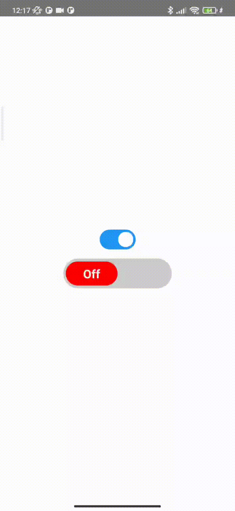
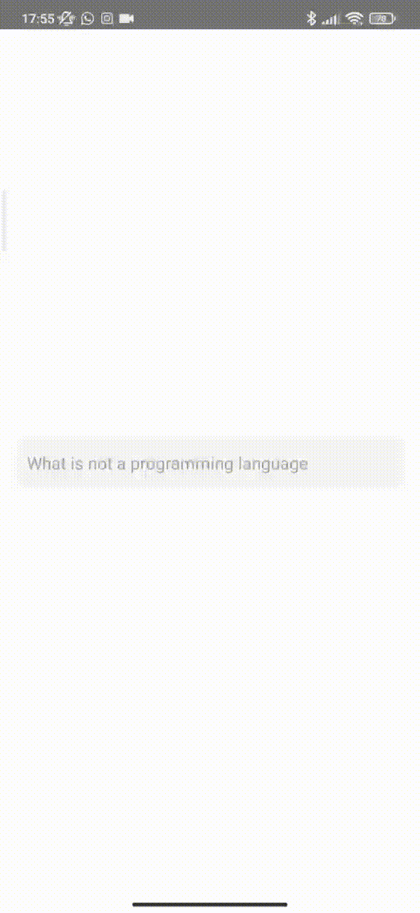
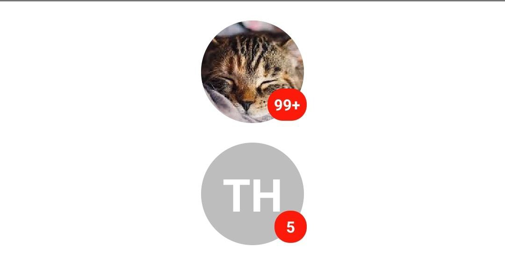

# itkitchen-react-native-ui-lib

itkitchen-react-native-ui-lib is a framework that contains a set of UI components and functions. 

## Setup
To install open your project in command line and run:
```
npm install itkitchen-react-native-ui-lib
```
OR
```
yarn add itkitchen-react-native-ui-lib
```
Thats it!

## Usage

For use you can import Functions and UI:

```javascript
import { Functions, UI } from 'itkitchen-react-native-ui-lib'
```

### UI

- **_Switch_** - is UI component of switch:

```javascript
import { Functions, UI } from 'itkitchen-react-native-ui-lib'

const [switchState, setSwitchState] = useState(false)

//...

return (
    <View style={styles.container}>
        <UI.Switch
            activeOpacity={0.6}
            textStyle={{
                fontSize: 20
            }}
            containderStyle={{
                width: "50%",
                height: 50
            }}
            circleStyle={{
                width: "50%",
                height: 40,
                borderRadius: 20
            }}
            enabledCircleColor="#4DC861"
            disabledCircleColor="red"
            enabledText="On"
            disabledText="Off"
            enabledBackgroundColor="#ccc"
            disabledBackgroundColor="#ccc"
            onChangeState={switchState => setSwitchState(switchState)}
        />
    </View>
)

//...

```




#### Props
Name | Description | Default | Type
------|-------------|----------|-----------
activeOpacity | opacity level on press | 0.6 | from 0 to 1
initPosition | initial position | false | bool
textStyle | switch text style | undefined | style
containderStyle | switch container style | undefined | style
circleStyle | switch circle style | undefined | style
enabledCircleColor | color for circle of switch when it is on | '#4DC861' | string
disabledCircleColor | color for circle of switch when it is off | 'red' | string
enabledText | text of switch when it is on | 'On' | string
disabledText | text of switch when it is off | 'Off' | string
enabledBackgroundColor | switch background color when it is on | '#ccc' | string
disabledBackgroundColor | switch background color when it is off | '#ccc' | string
onChangeState | callback when switch is clicked| (value) => {callback(value)} | func

<!-- - **_ListModal_** - removed. Maybe in the next update we will refactor and refund it. -->

- **_AnimatedHeaderList_** - is UI component with animated header. This component based on FlatList and support all props of it. 

```javascript
//...
import { Functions, UI } from 'itkitchen-react-native-ui-lib'

const { width, height } = Dimensions.get('window')

const styles = StyleSheet.create({
    container: {
        flex: 1,
        width,
    },
})

const link = "https://i.ytimg.com/vi/1KQGMnEn9K0/maxresdefault.jpg"

const orders = [link, link, link, link, link, link, link, link, link, link, link, link, link, link, link]

const AnimatedHeader = props => {

    const renderHeader = (offset) => {
        let x = offset.interpolate({
            inputRange: [0, 150],
            outputRange: [0, (-width / 2) + 50],
            extrapolate: 'clamp'
        })
        return (
            <Animated.Text
                style={{
                    color: "#ffffff",
                    fontSize: 14,
                    fontWeight: "bold",
                    transform: [{ translateX: x }],
                    position: "absolute",
                }}
            >Cats List</Animated.Text>
        )
    }

    const renderItem = ({ item, index }) => (
        <View
            style={{
                width: (width / 2) - 15,
                height: 250,
                marginHorizontal: 5,
                marginTop: 15,
                borderRadius: 5,
                overflow: 'hidden'
            }}
        >
            <Image source={{ uri: item }} style={{ width: "100%", height: 250 }} resizeMode="cover" />
        </View>
    )

    return (
        <UI.AnimatedHeaderList
            data={orders}
            style={styles.container}
            renderHeader={renderHeader}
            renderItem={renderItem}
            headerMinHeight={55}
            numColumns={2}
            headerMaxHeight={200}
            headerComponentsMinOpacity={1}
            headerBackgroundColor="#0366d6"
            headerContainertStyle={{
                alignItems: "center",
                justifyContent: "center",
                width: width / 2,
                height: 150
            }}
        />
    )
}
```


#### Props
Name | Description | Default | Type
------|-------------|----------|-----------
data | array of data | [] | array
style | style of list | {flex: 1, width: "100%"} | style
contentContainerStyle | style of list container | {alignItems: "center"} | style
headerContainertStyle | style of header container | {width: "100%", height: "100%"} | style
headerBackgroundColor | header background color | '#ffffff' | string
headerMaxHeight | header max height | 200 | number
headerMinHeight | header min height | 55 | number
headerComponentsMinOpacity | header components can change opacity on animate. If you don't wont use opacity set it to 1 | 0 | from 0  to 1
renderHeader | callback to render header. Offset parameter is scroll offset value. Also offset is animated value, you can use interpolate to it | (offset) => {return(Component)} | func
renderItem | callback to render item | ({ item, index }) => {return(Component)} | func
and all FlatList component props, without onScroll |  |  | any

- **_TextInput_** - is UI component with animated lable of text input. 

```javascript
//...
import { Functions, UI } from 'itkitchen-react-native-ui-lib'
//...
const [text, setText] = useState("")

return (
    <View style={styles.container}>
        <UI.TextInput
            placeholder="What is not a programming language"
            focusedPlaceholderTextColor="red"
            focusedContainerStyle={{
                borderColor: 'red',
                borderWidth: 1
            }}
            listData={[
                { value: 'js', label: 'JavaScript' },
                { value: 'php', label: 'PHP' },
                { value: 'python', label: 'Python' },
                { value: 'c', label: 'C++' },
                { value: 'ruby', label: 'Ruby' },
                { value: 'html', label: 'HTML' },
                { value: 'dart', label: 'Dart' },
            ]}
            listProps={{
                scrollView: {
                    style: {
                        width: 200
                    }
                },
                emptyText: 'Nothing is here'
            }}
        />
    </View>
)
//...
```



#### Props
Name | Description | Default | Type
------|-------------|----------|-----------
value | value of TextInput component | "" | string
containerStyle | style of text input container | {} | object
focusedContainerStyle | style of text input container when it focused | {} | object
style | style of TextInput component | {} | object
focusedStyle | style of TextInput component when it focused | {} | object
IconComponent | icon component that will render on right side of input | null | React Component
iconVisible | the boolean prop that hide or show right icon component | false | bool
LeftIconComponent | icon component that will render on left side of input | null | React Component
leftIconVisible | the boolean prop that hide or show left icon component | false | bool
disableAnimation | the boolean prop that disable animation | false | bool
focusedPlaceholderTextColor | if lable color shuld change on focus, pass your color to this props | same with placeholderTextColor | string
listData | array of object({value: Any, label: String}) | [] | array
listProps | object of list props {"containerStyle": Object,  style of list container. "scrollViewProps": ScrollViewProps, react-native ScrollView properties. "itemStyle": Object, list item style, "itemTextStyle": Object, list item text style, "emptyContainerStyle": Object, container style if list of suggestions is empty, "emptyTextStyle": Object, text style when list of suggestions is empty, "emptyText": Object, style of text when list of suggestions is empty } | {} | object
onListItemSelect | call back function when list item is pressed | () => {} | function
and all TextInput component props |  |  | any

- **_Button_** - is UI component of button.

```javascript
//...
import { Functions, UI } from 'itkitchen-react-native-ui-lib'
//...
return (
    <View style={styles.container}>
        <UI.Button 
            text="Button"
            style={{
                width: '95%',
                height: 40,
            }}
        />
    </View>
)
```


#### Props
Name | Description | Default | Type
------|-------------|----------|-----------
style | style of Button component | object | style
textStyle | style of button text | object | style
onPress | function that call when button pressed | onPress={()=>{}} | func
activeOpacity | determines what the opacity of the wrapped view should be when touch is active. From 0 to 1 | 0.6 | float
text | text that will display on button | "ItKitchenButton" | string
loading | boolean props that show or hide spinner, also if loading true function "onPress" will not be called | false | bool
loadingColor | color of loading spinner | "#ffffff" | string

- **_RadioButton_** - is UI component of radio button.

```javascript
import { Functions, UI } from 'itkitchen-react-native-ui-lib'
//...
const [value, setValue] = useState(false)
const [value1, setValue1] = useState(false)
//...
return (
    <View style={styles.container}>
        <UI.RadioButton
            value={value}
            title="Title"
            onPress={() => setValue(!value)}
            activeTintColor="red"
            inactiveTontColor="black"
        />
        <UI.RadioButton
            value={value1}
            title="Title 1"
            onPress={() => setValue1(!value1)}
            activeTintColor="red"
            inactiveTontColor="black"
        />
    </View>
)
```


#### Props
Name | Description | Default | Type
------|-------------|----------|-----------
containerStyle | style of the component container | object | style
radioButtonStyle | style of the outer circle | object | style
circleStyle | style of the inner circle | object | style
value | value of button, if true button is checked | false | bool
onPress | function that call when button pressed | onPress={()=>{}} | func
activeOpacity | determines what the opacity of the wrapped view should be when touch is active. From 0 to 1 | 0.6 | float
title | text that will display on right side of button | "" | string
activeTintColor | color when button is checked | "#494043" | string
inactiveTontColor | color when button is unchecked | "#494043" | string

- **_DropDown_** - is UI component of drop down list.

```javascript
import { Functions, UI } from 'itkitchen-react-native-ui-lib'
//...
const styles = StyleSheet.create({
    container: {
        flex: 1,
        width,
        alignItems: "center",
        justifyContent: "center"
    },
    dropdown: {
        width: "80%",
        borderRadius: 5,
        borderColor: "grey",
        borderWidth: 1,
        paddingHorizontal: 5
    }
})
//...
const [state, setState] = useState("")

const stringData = ["value 1", "value 2"]
const odjData = [{value: 1, label: "value 1"}, {value: 2, label: "value 2"}]

return (
    <View style={styles.container}>
        <UI.DropDown
            data={stringData}
            value={state}
            placeholder="Select value"
            onDataChange={value => setState(value)}
            style={styles.dropdown}
        />
    </View>
)
```


#### Props
Name | Description | Default | Type
------|-------------|----------|-----------
data | array of strings that will display on drop down list | [] | array
value | value that will display on button | "" | string
onDataChange | function that call when selected new value | onDataChange={value => {}} | func
style | style of the component container | object | style
textStyle | style of the component text | object | style
placeholderTextStyle | style of the component placeholder | object | style
menuStyle | style of the menu container | object | style
itemStyle | style of the menu item container | object | style
itemTextStyle | style of the menu item text | object | style
placeholder | value that will display when "value" property is empty  | "" | string

- **_Avatar_** - is UI component of image for lists to profile screens.

```javascript
import { Functions, UI } from 'itkitchen-react-native-ui-lib'
//...
const styles = StyleSheet.create({
    container: {
        flex: 1,
        width,
        alignItems: "center",
        justifyContent: "center"
    }
})
//...

return (
    <View style={styles.container}>
        <UI.Avatar
            imageUrl="https://thenypost.files.wordpress.com/2019/12/cat.jpg?quality=80&strip=all"
            nameString="Tit Hardwood"
            badge={999}
        />
        <Text>Tit Hardwood</Text>
    </View>
)
```



#### Props
Name | Description | Default | Type
------|-------------|----------|-----------
imageUrl | url to image | "" | String
nameString | string of user name or description | "" | string
onPress | function that call when avatar pressed | onPress={()=>{}} | func
badge | used if you need to render badge on avatar | 0 | number
style | style of the component container | object | style
imageStyle | style of the image | object | style
badgeStyle | style of the badge | object | style
badgeTextStyle | style of the badge | object | style

- **_Badge_** - is UI component used to render a numerical value.

```javascript
    import { Functions, UI } from 'itkitchen-react-native-ui-lib'
    //...
    const styles = StyleSheet.create({
        container: {
            flex: 1,
            width,
            alignItems: "center",
            justifyContent: "center"
        }
    })
    //...
    return (
        <View style={styles.container}>
            <UI.Badge badge={1} />
            <UI.Badge badge={12} />
            <UI.Badge badge={123} />
        </View>
    )
```


#### Props
Name | Description | Default | Type
------|-------------|----------|-----------
badge | used if you need to render badge on avatar | 0 | number
style | style of the component container | object | style
textStyle | style of the badge value | object | style

- **_Card_** - is UI component used to render some information. (deprecated from 1.3.6)

To use cards you need to install [react-native-vector-icons](https://www.npmjs.com/package/react-native-vector-icons)
```
npm install react-native-vector-icons
```
OR
```
yarn add react-native-vector-icons
```

1. **cardType - default**

```javascript
    import { Functions, UI } from 'itkitchen-react-native-ui-lib'
    //...
    const styles = StyleSheet.create({
        container: {
            flex: 1,
            width
        }
    })
    //...
    const arr = new Array(10).fill({
        imageUrl: 'https://encrypted-tbn0.gstatic.com/images?q=tbn%3AANd9GcSsb3dnwW7TWK8zRGaCQ_ThqeLRWTZKXsWAL5z6rI_9UAwM0NqH',
        title: "Cat",
        subTitle: "Sleeping sleeping sleeping sleeping sleeping sleeping sleeping sleeping sleeping sleeping sleeping sleeping sleeping sleeping sleeping sleeping sleeping sleeping sleeping sleeping sleeping sleeping sleeping sleeping sleeping sleeping sleeping sleeping"
    })
    //...
    return (
        <ScrollView
            style={styles.container}
            contentContainerStyle={{ alignItems: 'center' }}
        >
            {
                arr.map((item, index) => (
                    <UI.Card
                        key={index}
                        title={item.title}
                        subTitle={item.subTitle}
                        imageUrl={item.imageUrl}
                        like
                        share
                        comment
                        favorite
                        iconsSize={23}
                    />
                ))
            }
        </ScrollView>
    )
```


#### Props
Name | Description | Default | Type
------|-------------|----------|-----------
title | title of card | "" | string
subTitle | subtitle of card | "" | string
imageUrl | url to image  | "" | string
like | bool property to show or hide like icon | false | bool
comment | bool property to show or hide comment icon | false | bool
favorite | bool property to show or hide favorite icon | false | bool
share | bool property to show or hide share icon | false | bool
liked | bool property mark like icon | false | bool
commented | bool property mark comment icon | false | bool
favorited | bool property mark favorite icon | false | bool
shared | bool property mark share icon | false | bool
iconsSize | size of icons | 22 | number
onPress | function that call when card pressed | onPress={()=>{}} | func 
onLikePress| function that call when like icon pressed | onPress={()=>{}} | func
onCommentPress | function that call when comment icon pressed | onPress={()=>{}} | func 
onFavoritePress | function that call when favorite icon pressed | onPress={()=>{}} | func 
onSharePress | function that call when share icon pressed | onPress={()=>{}} | func 
CustomFooter | Custom component that will render on bottom of card instead of icons | React Component
actionsColor | color of icons when icon is not marked | "#000000" | string
altActionsColor | color of icons when icon is marked | "#ff0000" | string
containerStyle | style of component container | object | style
imageStyle | style of the image | object | style
infoContainerStyle | style of info container(title and subtitle) | object | style 
titleStyle | style of card title | object | style
subTitleStyle | style of card subtitle | object | style
footerContainerStyle | style of info container on bottom of card | object | style 

2. **cardType - animated**

```javascript
    import { Functions, UI } from 'itkitchen-react-native-ui-lib'
    //...
    const styles = StyleSheet.create({
        container: {
            flex: 1,
            width,
            alignItems: "center",
            justifyContent: "center"
        }
    })
    //...
    const arr = new Array(10).fill({
        imageUrl: 'https://encrypted-tbn0.gstatic.com/images?q=tbn%3AANd9GcSsb3dnwW7TWK8zRGaCQ_ThqeLRWTZKXsWAL5z6rI_9UAwM0NqH',
        title: "Cat",
        subTitle: "Sleeping sleeping sleeping sleeping sleeping sleeping sleeping sleeping sleeping sleeping sleeping sleeping sleeping sleeping sleeping sleeping sleeping sleeping sleeping sleeping sleeping sleeping sleeping sleeping sleeping sleeping sleeping sleeping"
    })
    //...
    return (
        <ScrollView
            style={styles.container}
            contentContainerStyle={{ alignItems: 'center' }}
        >
            {
                arr.map((item, index) => (
                    <UI.Card
                        cardType="animated"
                        key={index}
                        title={item.title}
                        subTitle={item.subTitle}
                        imageUrl={item.imageUrl}
                        InfoComponent={
                            <Text>More info here</Text>
                        }
                    />
                ))
            }
        </ScrollView>
    )
```


#### Props
Name | Description | Default | Type
------|-------------|----------|-----------
title | title of card | "" | string
subTitle | subtitle of card | "" | string
imageUrl | url to image  | "" | string
onPress | function that call when card pressed | onPress={()=>{}} | func 
InfoComponent | Custom component that will render more info opened | React Component
containerStyle | style of component container | object | style
titleStyle | style of card title | object | style
subTitleStyle | style of card subtitle | object | style

3. **cardType - background**

```javascript
    import { Functions, UI } from 'itkitchen-react-native-ui-lib'
    //...
    const styles = StyleSheet.create({
        container: {
            flex: 1,
            width,
            alignItems: "center",
            justifyContent: "center"
        }
    })
    //...
    const arr = new Array(10).fill({
        imageUrl: 'https://encrypted-tbn0.gstatic.com/images?q=tbn%3AANd9GcSsb3dnwW7TWK8zRGaCQ_ThqeLRWTZKXsWAL5z6rI_9UAwM0NqH',
        title: "Cat",
        subTitle: "Sleeping sleeping sleeping sleeping sleeping sleeping sleeping sleeping sleeping sleeping sleeping sleeping sleeping sleeping sleeping sleeping sleeping sleeping sleeping sleeping sleeping sleeping sleeping sleeping sleeping sleeping sleeping sleeping"
    })
    //...
    return (
        <ScrollView
            style={styles.container}
            contentContainerStyle={{ alignItems: 'center' }}
        >
            {
                arr.map((item, index) => (
                    <UI.Card
                        cardType="background"
                        key={index}
                        title={item.title}
                        subTitle={item.subTitle}
                        imageUrl={item.imageUrl}
                        like
                        share
                        comment
                        favorite
                        iconsSize={23}
                    />
                ))
            }
        </ScrollView>
    )
```


#### Props
Name | Description | Default | Type
------|-------------|----------|-----------
title | title of card | "" | string
subTitle | subtitle of card | "" | string
imageUrl | url to image  | "" | string
like | bool property to show or hide like icon | false | bool
comment | bool property to show or hide comment icon | false | bool
favorite | bool property to show or hide favorite icon | false | bool
share | bool property to show or hide share icon | false | bool
liked | bool property mark like icon | false | bool
commented | bool property mark comment icon | false | bool
favorited | bool property mark favorite icon | false | bool
shared | bool property mark share icon | false | bool
iconsSize | size of icons | 22 | number
onPress | function that call when card pressed | onPress={()=>{}} | func 
onLikePress| function that call when like icon pressed | onPress={()=>{}} | func
onCommentPress | function that call when comment icon pressed | onPress={()=>{}} | func 
onFavoritePress | function that call when favorite icon pressed | onPress={()=>{}} | func 
onSharePress | function that call when share icon pressed | onPress={()=>{}} | func 
CustomFooter | Custom component that will render on bottom of card instead of icons | React Component
actionsColor | color of icons when icon is not marked | "#000000" | string
altActionsColor | color of icons when icon is marked | "#ff0000" | string
containerStyle | style of component container | object | style
imageStyle | style of the image | object | style
infoContainerStyle | style of info container(title and subtitle) | object | style 
titleStyle | style of card title | object | style
subTitleStyle | style of card subtitle | object | style
footerContainerStyle | style of info container on bottom of card | object | style 

### Functions
- **_normalize_** - is a function which normalizes the font size of the text relative to the screen size.

```javascript
import { Functions, UI } from 'itkitchen-react-native-ui-lib'

//...

return (
    <View style={styles.container}>
        <Text style={{ fontSize: Functions.normalize(14), color: "#000000", marginBottom: 15 }}>Some text</Text>
    </View>
);

const styles = StyleSheet.create({
    container: {
        flex: 1,
        justifyContent: 'center',
        alignItems: 'center',
        backgroundColor: '#F5FCFF',
    },
});
```

- **_wordsFromUpperCase_** - is a regex function that replace words first lower case character to upper.

```javascript
import { Functions, UI } from 'itkitchen-react-native-ui-lib'

//...

return (
    <View style={styles.container}>
        <Text style={{ fontSize: 14, color: "#000000" }}>{"some text without upper case"}</Text>
        <Text style={{ fontSize: 14, color: "#000000" }}>{Functions.wordsFromUpperCase("some text without upper case")}</Text>
    </View>
);

const styles = StyleSheet.create({
    container: {
        flex: 1,
        justifyContent: 'center',
        alignItems: 'center',
        backgroundColor: '#F5FCFF',
    },
});
```


- **_emailValid_** - is a regex function that return *true* if email is valid and return *false* if is not.

```javascript
import { Functions, UI } from 'itkitchen-react-native-ui-lib'

//...

const [email, setEmail] = useState("")

const checkEmail = () => {
    let check = Functions.emailValid(email)
    alert(check)
}

return (
    <View style={styles.container}>
        <UI.TextInput
            value={email}
            onChangeText={email => setEmail(email)}
            placeholder="Введите ваше имя"
            style={styles.textInput}
        />
        <TouchableOpacity onPress={checkEmail} style={styles.buttonContainer}>
            <Text style={{ color: "#ffffff" }}>Check email</Text>
        </TouchableOpacity>
    </View>
)

//...

const styles = StyleSheet.create({
    container: {
        flex: 1,
        justifyContent: 'center',
        alignItems: 'center',
        backgroundColor: '#F5FCFF',
    },
    buttonContainer: {
        width: "90%",
        height: 50,
        alignItems: "center",
        justifyContent: "center",
        backgroundColor: "blue",
        borderRadius: 24,
    },
    textInput: {
        height: 45,
        width: "90%",
        borderRadius: 24,
        backgroundColor: '#e8e8e8',
        justifyContent: "center",
        paddingHorizontal: 15,
        marginBottom: 15
    }
});
```


- **_hexToRgba_** - is a function that can convert color hex value to rgb or rgba.

```javascript
import { Functions, UI } from 'itkitchen-react-native-ui-lib'
//...
const color = "#c260b5"
const alpha = 0.2
return (
    <View style={styles.container}>
        <Text>{color}</Text>
        <Text>{Functions.hexToRgba(color)}</Text>
        <Text>{Functions.hexToRgba(color, alpha)}</Text>
    </View>
)
```

